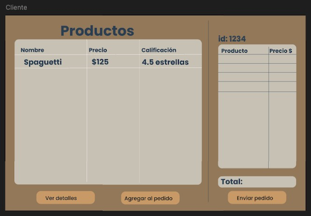
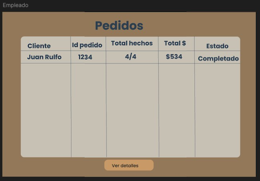
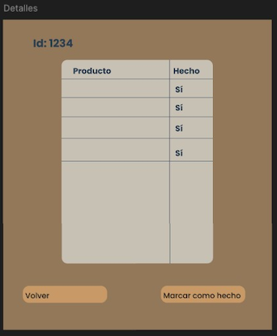
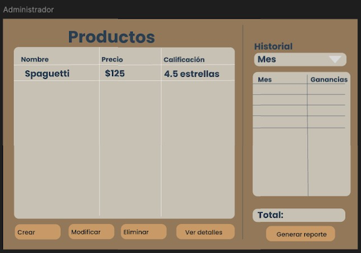

# Proyecto de Construcción de Software

## 📝 Descripción
Este proyecto es parte de la clase de *Construcción de software* y se enfoca en desarrollar un sistema integral para la administración de una cafetería. El objetivo principal es aplicar lineamientos de buenas prácticas de codificación, siguiendo principios de diseño y las mejores prácticas de desarrollo, inspiradas en obras como *Code Complete* y *Clean Code* 📗.

## Requisitos del Sistema

### 1. Gestión de Usuarios
- El sistema debe permitir el inicio de sesión para tres tipos de usuarios: cliente, empleado y administrador.
- El sistema debe tener un mecanismo de autenticación para validar a los usuarios por tipo (cliente, empleado, administrador).
- El sistema debe mostrar diferentes interfaces para cada usuario según sus permisos.

### 2. Funcionalidades del Cliente
- El cliente debe poder visualizar el menú de productos disponibles en la cafetería.
- El cliente debe poder seleccionar productos del menú para hacer un pedido.
- El cliente debe poder ver el total del pedido antes de confirmarlo.
- El sistema debe permitir al cliente confirmar y enviar el pedido a los empleados para su procesamiento.
- El cliente debe recibir una confirmación de que su pedido ha sido registrado exitosamente.
- El cliente debe poder proporcionar retroalimentación sobre los productos que ha pedido.
- El cliente debe poder calificar los productos en una escala de 1 a 5 estrellas.

### 3. Funcionalidades del Empleado
- El empleado debe poder ver todos los pedidos pendientes realizados por los clientes.
- El empleado debe poder registrar el cobro de cada pedido.
- El empleado debe poder marcar un pedido como entregado una vez se haya realizado el cobro.
- El empleado debe poder ver el estado de los pedidos:
  - **Pendiente:** Cuando aún no se han terminado todos los productos del pedido.
  - **Completado:** Cuando todos los productos del pedido se han hecho.
  - **Entregado:** Cuando ya se ha hecho el pago correspondiente y se ha entregado el pedido.

### 4. Funcionalidades del Administrador
- El administrador debe poder visualizar un historial completo de pedidos realizados por los clientes.
- El administrador debe poder agregar, editar y eliminar productos del menú.
- El administrador debe poder modificar el precio de los productos en el menú.
- El administrador debe tener acceso a reportes diarios, semanales y mensuales de las ventas.
- El administrador debe poder revisar y gestionar las retroalimentaciones y calificaciones de los productos.

## Vistas del Proyecto

### **Ingreso**

### **Registro**

---

### **Cliente**
#### Vista Principal

#### Detalles del Pedido

#### Agregar Producto

---

### **Empleado**
#### Vista Principal

#### Detalles del Pedido

---

### **Administrador**
#### Vista Principal

## Diagramas
[Aquí](/Diagramas)

## 🌟 Características principales
El sistema incluye la gestión de tres tipos de usuarios:
- **Cliente** 🧑‍💼: Puede realizar pedidos, ver el menú y dar feedback de los productos.
- **Empleado** 👨‍🍳: Tiene acceso a funcionalidades de gestión de pedidos y atención al cliente.
- **Administrador** 🧑‍💻: Puede gestionar los recursos de la cafetería, incluyendo inventarios,y reportes.

## 🛠️ Tecnologías Utilizadas
- **Lenguaje**: Java ☕

## 🗂️ Estructura del Proyecto
El código está organizado en tres paquetes principales:
- **modelo**: Contiene las clases de la lógica de negocio y entidades.
- **vista**: Incluye las clases que manejan la presentación y la interacción con el usuario.
- **controlador**: Gestiona la lógica de control y la interacción entre la vista y el modelo.

## 🤝 Equipo:
- Russel Bonilla Pech
- Jaqueline Góngora Tun
- Frida Pineda Alvarado
- Víctor Rosado Koyoc
- Luisa Villanueva Díaz

## Supuestos y limitaciones
El sistema debe estar funcionando para el día 3 de Diciembre del 2024.

## Entregables del proyecto
- Los siguientes productos se producirán durante el proyecto:
- Diagrama de clases de la aplicación
- Código de la aplicación.
- Lista de todas las prácticas de construcción de software abordadas

# Roles y responsabilidades:

La siguiente tabla muestra las funciones representadas en el diagrama del proyecto y de sus responsabilidades primarias.

| Nombre            | Rol                              | Descripción                                                                                                                                         |
|-------------------|----------------------------------|-----------------------------------------------------------------------------------------------------------------------------------------------------|
| Russel Bonilla    | Líder de Proyecto               | Responsable de coordinar y supervisar todas las actividades del proyecto, asegurando el cumplimiento de plazos y objetivos.                        |
| Jaqueline Gongora | Especialista en Pruebas         | Se encarga de realizar pruebas del sistema para identificar y documentar errores. Garantiza que el sistema cumpla con los requisitos.              |
| Frida Pineda      | Desarrollador de Funcionalidades del Sistema | Encargado de implementar las funcionalidades relacionadas con la gestión de usuarios y la lógica de las operaciones de cliente, empleado y administrador. |
| Víctor Rosado     | Desarrollador de Funcionalidades del Sistema | Encargado de implementar las funcionalidades relacionadas con la gestión de usuarios y la lógica de las operaciones de cliente, empleado y administrador. |
| Luisa Villanueva  | Desarrollador de Interfaz Gráfica| Responsable de la programación de la interfaz gráfica del sistema, asegurando que las vistas de cliente, empleado y administrador sean intuitivas y responsivas. |

# Cronograma

[Cronograma.pdf](https://alumnosuady-my.sharepoint.com/:b:/g/personal/a19203622_alumnos_uady_mx/EakqXO-TwxxBmqy33gT6u88BKNpGArACHTLILWM6onHT8g?e=cVeEac)

# Checklist de prácticas de construcción:

[Aquí](/Practicas%20de%20construcción.pdf)